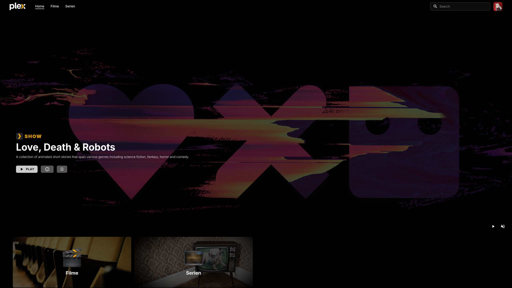

# PerPlexed
Fixing Plex's old and simple UI.

[**Docker Hub**](https://hub.docker.com/r/ipmake/perplexed )




## Description

PerPlexed is a complete redesign of Plex's UI using the plex media server's API. It comes with its own web server. As the keen eye may notice, the UI is heavily inspired by Netflix's UI. It is currently only developed for desktops and laptops. It is not optimized for mobile or TV use.

PerPlexed currently supports Movie and TV Show libraries. You can also play media via the interface.

It is currently not possible to edit media metadata or switch between different Plex servers. The "+" and Star buttons on the info pages for shows and movies are placeholders are currently not functional.

Mind that this project is still in development and may be unstable.

## Installation

### Docker

The easiest way to run PerPlexed is to use Docker. You can use the following command to run PerPlexed in a Docker container:

```bash
docker run --name perplexed -p 3000:3000 -e PLEX_SERVER=http://your-plex-server:32400 ipmake/perplexed
```

## Contributing
Pull requests are welcome for any feature or bug fix. For major changes, please open an issue first to discuss what you would like to change.

## Development

We use multi stage build with docker. Simply run following commands.

```bash
docker build -t perplexed .
docker run --name perplexed -p 3000:3000 -e PLEX_SERVER=http://your-plex-server:32400 perplexed
```
