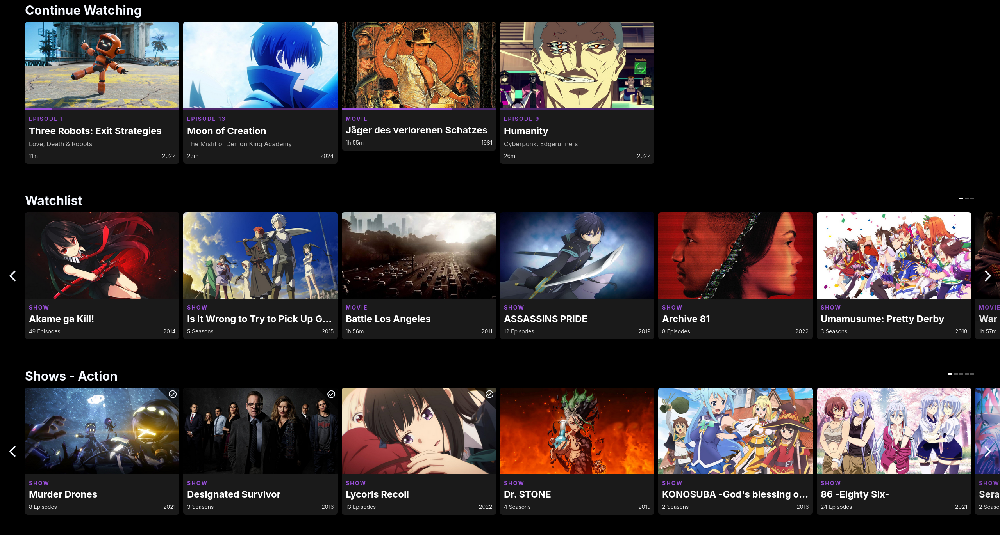

# NEVU for Plex
Fixing Plex's old and simple UI.

[**Docker Hub**](https://hub.docker.com/r/ipmake/nevu)

*Click image for video*
[](https://www.youtube.com/watch?v=PuTOw3Wg9oY)

## Description

Nevu is a complete redesign of Plex's UI using the Plex media server's API. It comes with its own web server. As the keen eye may notice, the UI is heavily inspired by Netflix's UI. It is currently only developed for desktops and laptops. It is not optimized for mobile or TV use.

Nevu currently supports Movie and TV Show libraries. You can also play media via the interface.

It is currently not possible to edit media metadata or switch between different Plex servers. The "+" and Star buttons on the info pages for shows and movies are placeholders and are currently not functional.

Mind that this project is still in development and may be unstable.


## Features
- Modern UI
- Seamless Plex integration
- Netflix-like UI
- Play media
- Browse libraries
- Search for media
- Watch Together (Nevu Sync)
- Get Recommendations
- Simple and easy to use
- Pro-User features (like special shortcuts etc.)

## Installation

### Docker

The easiest way to run Nevu is to use Docker. You can use the following command to run Nevu in a Docker container:

```bash
docker run --name nevu -p 3000:3000 -e PLEX_SERVER=http://your-plex-server:32400 ipmake/nevu
```

#### Environment Variables
| Name                   | Type       | Required | Description                                                                 |
|------------------------|------------|----------|-----------------------------------------------------------------------------|
| PLEX_SERVER            | string     | Yes      | The URL of the Plex server that the frontend will connect to                |
| PROXY_PLEX_SERVER      | string     | No       | The URL of the Plex server to proxy requests to                             |
| DISABLE_PROXY          | true/false | No       | If set to true, the proxy will be disabled and all requests go directly to the Plex server from the frontend (NOT RECOMMENDED) |
| DISABLE_TLS_VERIFY     | true/false | No       | If set to true, the proxy will not check any https ssl certificates         |
| DISABLE_nevu_SYNC | true/false | No       | If set to true, Nevu sync (watch together) will be disabled            |
| DISABLE_REQUEST_LOGGING| true/false | No       | If set to true, the server will not log any requests                        |


## Contributing
Pull requests are welcome for any feature or a bug fix. For major changes, please open an issue first to discuss what you would like to change.

## Development

To develop you need 2 terminals for the front and the backend of Nevu

```bash
# Terminal 1
cd frontend
npm start

# Terminal 2
cd backend
PLEX_SERVER=http://plex-server:32400 npm start
```
